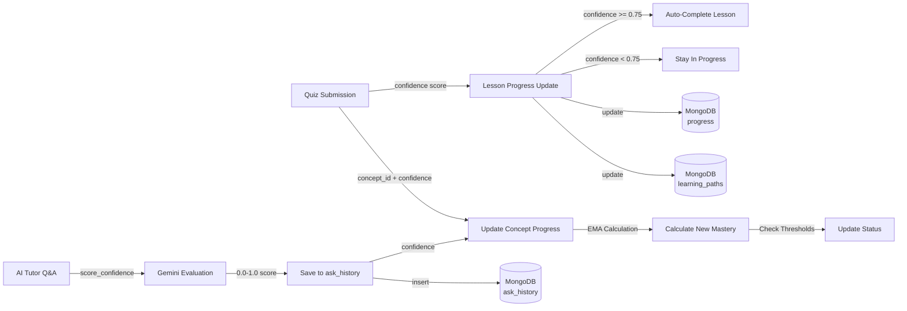

# Quiz/Exercise Submission and Progress Tracking System Analysis

## Executive Summary

This system uses a **multi-layered approach** for tracking quiz/exercise submissions:
1. **Lesson Progress Tracking**: Stores completion state and confidence scores for lessons
2. **Concept Progress Tracking**: Uses Exponential Moving Average (EMA) algorithm to track mastery
3. **Question-Answer History**: Saves all Q&A interactions from the AI tutor
4. **Auto-completion Engine**: Automatically completes lessons when confidence >= 75%

---

## 1. QUIZ SUBMISSION ENDPOINTS

### 1.1 **Lesson Progress Submission** (Primary Entry Point)
- **Endpoint**: `POST /learning-paths/lesson-progress`
- **File**: [backend/app/api/learning_paths.py](backend/app/api/learning_paths.py#L85)
- **Request Schema**:
  ```python
  {
    "path_id": str,              # Learning path UUID
    "lesson_id": str,            # Lesson identifier  
    "status": str,               # "not_started" | "in_progress" | "completed"
    "confidence": float (0.0-1.0) # Optional: confidence score from quiz
  }
  ```

### 1.2 **Concept Progress Update**
- **Endpoint**: `POST /progress/update`
- **File**: [backend/app/api/progress.py](backend/app/api/progress.py#L64)
- **Request Schema**:
  ```python
  {
    "user_id": str,              # MongoDB ObjectId as string
    "concept_id": int,           # Concept ID (integer)
    "mastery": float (0.0-1.0),  # Mastery score
    "confidence": float (0.0-1.0), # Confidence score
    "total_attempts": int        # Default: 1
  }
  ```

### 1.3 **AI Tutor Question & Answer Submission**
- **Endpoint**: `POST /ask/`
- **File**: [backend/app/api/ask.py](backend/app/api/ask.py#L138)
- **Request Schema**:
  ```python
  {
    "user_id": str,              # MongoDB ObjectId as string
    "question": str,             # User's question (5-2000 chars)
    "goal": str,                 # Learning goal (3-500 chars)
    "level": str,                # "beginner" | "intermediate" | "advanced"
    "completed": List[str]       # Optional: list of completed concepts
  }
  ```
- **Response includes**: `confidence` score for the answer

---

## 2. DATA MODELS - WHAT'S BEING SAVED

### 2.1 **Progress Collection** (per concept per user)
**MongoDB Collection**: `progress`

Fields stored on quiz submission:
```javascript
{
  "_id": ObjectId,
  "user_id": string,              // User ID
  "concept_id": int,              // Concept ID
  "mastery": float (0.0-1.0),     // EMA-updated mastery score
  "confidence": float (0.0-1.0),  // Most recent confidence
  "total_attempts": int,          // Total quiz attempts
  "successful_attempts": int,     // Attempts >= 0.3 confidence threshold
  "success_rate": float,          // successful_attempts / total_attempts
  "status": string,               // "not_started" | "in_progress" | "proficient" | "complete"
  "last_updated": datetime        // When this was last updated
}
```

**Source File**: [backend/app/services/progress_tracking/progress.py](backend/app/services/progress_tracking/progress.py#L235)

### 2.2 **Learning Paths Collection** (tracks lesson progress)
**MongoDB Collection**: `learning_paths`

Fields related to quiz submission:
```javascript
{
  "_id": ObjectId,
  "path_id": string,              // UUID
  "user_id": string,              // User ID
  "goal": string,                 // Learning goal
  "level": string,                // User level
  "lesson_progress": {            // Maps lesson_id -> status
    "lesson_id_1": "not_started",
    "lesson_id_2": "in_progress",
    "lesson_id_3": "completed"
  },
  "generated_at": datetime,
  "updated_at": datetime,
  "chapters": [                   // Available lessons in path
    {
      "chapter_id": string,
      "lessons": [
        {
          "lesson_id": string,
          "last_confidence": float,
          "confidence_updated_at": datetime
        }
      ]
    }
  ]
}
```

### 2.3 **Ask History Collection** (Q&A tracking)
**MongoDB Collection**: `ask_history`

Fields saved on each question submission:
```javascript
{
  "_id": ObjectId,
  "user_id": string,
  "question": string,             // The question asked
  "answer": string,               // AI's answer text
  "goal": string,                 // Learning goal
  "level": string,                // User level
  "concept_id": int,              // Detected concept
  "concept_name": string,         // Concept name
  "confidence": float,            // AI confidence in the answer
  "timestamp": datetime
}
```

**Source File**: [backend/app/api/ask.py](backend/app/api/ask.py#L54)

---

## 3. PROGRESS TRACKING ALGORITHM

### 3.1 **EMA (Exponential Moving Average) Update**
**File**: [backend/app/services/progress_tracking/progress.py](backend/app/services/progress_tracking/progress.py#L235)

When a quiz submission updates progress:

```
new_mastery = old_mastery * (1 - α) + confidence * α

where:
  α = learning rate (default: 0.3, configurable via env PROGRESS_ALPHA)
  confidence = 0.0 to 1.0 score from the quiz
  old_mastery = previous mastery (default: 0 if first attempt)
```

**Example**:
- First attempt with confidence 0.8: mastery = 0 × 0.7 + 0.8 × 0.3 = **0.24**
- Second attempt with confidence 0.7: mastery = 0.24 × 0.7 + 0.7 × 0.3 = **0.38**
- Third attempt with confidence 1.0: mastery = 0.38 × 0.7 + 1.0 × 0.3 = **0.566**

### 3.2 **Status Calculation**
Based on mastery score after EMA update:

```
mastery >= 0.8        → status = "complete" (user has mastered concept)
mastery >= 0.6        → status = "proficient" (user is proficient)
mastery > 0           → status = "in_progress" (still learning)
mastery == 0          → status = "not_started" (never attempted)
```

**Thresholds** (configurable via env vars):
- `PROGRESS_MASTERY_COMPLETE=0.8`
- `PROGRESS_MASTERY_PROFICIENT=0.6`
- `PROGRESS_MIN_CONFIDENCE=0.3` (attempts < 0.3 don't count as "successful")

### 3.3 **Attempt Tracking**
```
total_attempts = total_attempts + 1 (increment on every submission)

If confidence >= 0.3:
  successful_attempts = successful_attempts + 1

success_rate = successful_attempts / total_attempts
```

---

## 4. CONFIDENCE SCORE GENERATION

### 4.1 **How Confidence Scores Are Calculated**
**File**: [backend/app/services/progress_tracking/confidence_scorer.py](backend/app/services/progress_tracking/confidence_scorer.py#L143)

Process for quiz/answer evaluation:
1. **AI Evaluation** (Gemini LLM): Calls Gemini to evaluate student answer against question
2. **Prompt**: Sends question + student answer + optional context to Gemini
3. **Gemini Response**: Returns a number between 0.0 and 1.0
4. **Parsing**: Extracts numeric score from response (handles multiple response formats)
5. **Fallback**: Returns 0.5 if API fails or no number extracted

**Config**:
```python
CONFIDENCE_MODEL = "models/gemini-2.5-flash"  # env: CONFIDENCE_MODEL
DEFAULT_FALLBACK_SCORE = 0.5                  # Fallback if Gemini fails
```

### 4.2 **Confidence Score Pipeline**
```
Student Answer (quiz submission)
  ↓
score_confidence(question, answer, context)
  ↓
Gemini LLM evaluation (if API available)
  ↓
Extract 0.0-1.0 score from response
  ↓
update_progress_with_confidence(user_id, concept_id, confidence)
  ↓
EMA calculation → new mastery
  ↓
Status calculation (not_started/in_progress/proficient/complete)
```

### 4.3 **Answer Confidence in AI Tutor**
When using `/ask/` endpoint:
- AI generates answer with semantic search (RAG)
- Confidence is part of the answer object returned
- Automatically saved to `ask_history` collection

---

## 5. LESSON AUTO-COMPLETION SYSTEM

### 5.1 **Auto-Complete Rules**
**File**: [backend/app/services/lesson_completion_engine.py](backend/app/services/lesson_completion_engine.py#L1)

```python
AUTO_COMPLETE_CONFIDENCE_THRESHOLD = 0.75  # 75% confidence threshold
COMPLETION_CONFIDENCE_THRESHOLD = 0.75

If confidence >= 0.75:
  lesson["auto_completed"] = True
  lesson["status"] = "completed"
Else:
  lesson["auto_completed"] = False
  lesson["status"] = "in_progress"  # Stays blocked
```

### 5.2 **Lesson Prerequisite Locking**
```
First lesson in first chapter:
  → Always accessible (no prerequisites)

Subsequent lessons:
  → Must complete previous lesson in same chapter
  → Must complete last lesson of previous chapter to start new chapter
  
A lesson is "locked" if:
  - Its prerequisite lesson status != "completed"
  - User cannot access it until prerequisite is done
```

### 5.3 **Lock Status Tracking**
```javascript
LessonProgressResponse {
  "path_id": string,
  "lesson_id": string,
  "status": string,
  "is_locked": bool,
  "reason_locked": string | null,
  "blocking_lesson_id": string | null,
  "auto_completed": bool,
  "last_confidence": float,
  "confidence_updated_at": datetime,
  "updated_at": datetime
}
```

---

## 6. COMPLETE SUBMISSION FLOW

### 6.1 **Flow: Quiz Submission → Progress Update → Auto-Completion**

```
1. FRONTEND: User completes quiz
   └→ Calculate: score (e.g., 5/6 = 83%), confidence = score/100
   
2. FRONTEND: POST /learning-paths/lesson-progress
   {
     "path_id": "uuid",
     "lesson_id": "lesson_123", 
     "status": "in_progress",
     "confidence": 0.83
   }

3. BACKEND: learning_path_service.update_lesson_progress()
   │
   ├→ Check if lesson is locked (prerequisite not complete?)
   │  └→ If locked, return {is_locked: true, reason: "..."}
   │
   ├→ Update lesson_progress[lesson_id] = "in_progress"
   │
   ├→ Save confidence to learning_paths collection
   │  └→ lesson["last_confidence"] = 0.83
   │  └→ lesson["confidence_updated_at"] = now
   │
   ├→ Check auto-completion: confidence >= 0.75?
   │  ├→ YES: auto_completed = true, status = "completed"
   │  └→ NO: auto_completed = false, status stays "in_progress"
   │
   ├→ Update learning_paths document
   │
   └→ Return LessonProgressResponse

4. BACKEND: Optional - Update concept progress
   │ (if concept mapped to lesson)
   │
   ├→ Call update_progress_with_confidence(user_id, concept_id, 0.83)
   │
   ├→ Fetch current progress record
   │
   ├→ Calculate new mastery using EMA:
   │  └→ new_mastery = old_mastery * 0.7 + 0.83 * 0.3
   │
   ├→ Update attempts:
   │  ├→ total_attempts += 1
   │  ├→ If confidence >= 0.3: successful_attempts += 1
   │  └→ success_rate = successful_attempts / total_attempts
   │
   ├→ Calculate status based on new mastery
   │
   └→ Save to progress collection with UPSERT

5. FRONTEND: Receives response
   ├→ If auto_completed = true:
   │  └→ Show "Lesson completed!" message
   │  └→ Unlock next lesson
   └→ Else:
      └→ Show "Keep practicing!" message
      └→ Lesson stays locked for next attempt
```

### 6.2 **Flow: AI Tutor Q&A Submission**

```
1. FRONTEND: POST /ask/
   {
     "user_id": "user_id",
     "question": "How do I use list comprehensions?",
     "goal": "Learn Python",
     "level": "intermediate"
   }

2. BACKEND: AITutorService.ask_ai()
   │
   ├→ RAG retrieval (semantic search for context)
   ├→ LLM generation (Gemini answer)
   ├→ Concept detection (map question → concept_id)
   │
   ├→ Score confidence (call score_confidence LLM)
   │  └→ Gemini evaluates answer quality → 0.0-1.0 score
   │
   ├→ Update progress:
   │  └→ update_progress_with_confidence(user_id, concept_id, confidence)
   │
   ├→ Determine adaptive learning mode (remedial/normal/advanced)
   │  └→ Based on mastery + success_rate
   │
   └→ Generate recommended next concepts

3. BACKEND: Save to ask_history
   {
     "user_id": user_id,
     "question": "How do I use list comprehensions?",
     "answer": "AI's answer text...",
     "confidence": 0.87,
     "concept_id": 5,
     "concept_name": "list_comprehension",
     "timestamp": now
   }

4. FRONTEND: Receives AskResponse
   {
     "success": true,
     "answer": {
       "answer_text": "...",
       "confidence": 0.87,
       "sources": [...]
     },
     "progress_updated": true,
     "concept_detected": {...},
     "adaptive_info": {...},
     "learning_path": [...]
   }
```

---

## 7. DATABASE SCHEMA SUMMARY

### Collections Used for Quiz Tracking

| Collection | Purpose | Key Fields |
|-----------|---------|-----------|
| `progress` | Concept mastery tracking (EMA) | `user_id`, `concept_id`, `mastery`, `confidence`, `total_attempts`, `status`, `last_updated` |
| `learning_paths` | Lesson completion state | `path_id`, `user_id`, `lesson_progress` (dict), `chapters`, `lesson_progress.*.last_confidence` |
| `ask_history` | Q&A interaction logging | `user_id`, `question`, `answer`, `confidence`, `concept_id`, `timestamp` |
| `question_bank` | Lesson quiz questions | `lesson_id`, `question`, `correct_answer`, `distractors`, `difficulty`, `is_ai_generated` |

### Indexes for Performance
```mongodb
// progress collection
db.progress.createIndex([("user_id", 1), ("concept_id", 1)])
db.progress.createIndex([("user_id", 1), ("last_updated", -1)])
db.progress.createIndex([("user_id", 1), ("status", 1)])

// ask_history collection  
db.ask_history.createIndex([("user_id", 1), ("timestamp", -1)])

// learning_paths collection
db.learning_paths.createIndex([("user_id", 1), ("path_id", 1)])
db.learning_paths.createIndex([("user_id", 1), ("generated_at", -1)])

// question_bank collection
db.question_bank.createIndex([("lesson_id", 1), ("created_at", -1)])
```

---

## 8. CONFIGURATION & ENVIRONMENT VARIABLES

### Progress Tracking Config
```bash
PROGRESS_ALPHA = 0.3                    # EMA learning rate (0-1)
PROGRESS_MIN_CONFIDENCE = 0.3           # Min confidence to count as "successful"
PROGRESS_MASTERY_PROFICIENT = 0.6       # Threshold for "proficient" status
PROGRESS_MASTERY_COMPLETE = 0.8         # Threshold for "complete" status
```

### Lesson Completion Config (hardcoded)
```python
AUTO_COMPLETE_CONFIDENCE_THRESHOLD = 0.75  # Auto-complete if confidence >= 75%
COMPLETION_CONFIDENCE_THRESHOLD = 0.75
```

### AI Tutor Config
```bash
CONFIDENCE_MODEL = "models/gemini-2.5-flash"   # Gemini model for confidence scoring
GEMINI_API_KEY = <your_api_key>                # Required for confidence scoring
DEFAULT_CONFIDENCE_SCORE = 0.5                 # Fallback if API fails
```

---

## 9. CURRENT FLOW DIAGRAM



---

## 10. KEY FINDINGS & RECOMMENDATIONS

### Current Strengths
✅ **Comprehensive tracking**: Captures both lesson-level and concept-level progress  
✅ **EMA algorithm**: Responsive learning curve that weights recent performance  
✅ **Auto-completion**: Reduces friction for advanced students  
✅ **Multi-layered insights**: Q&A history + progress + mastery tracking  
✅ **Prerequisite enforcement**: Prevents students from skipping lessons  

### Potential Improvements
⚠️ **Confidence score dependency**: Relies on Gemini API availability; fallback is crude  
⚠️ **No explicit quiz attempt history**: Only aggregate attempts, not individual responses  
⚠️ **No time-based analytics**: Study time tracked separately, not correlated with performance  
⚠️ **Limited error tracking**: No explicit "incorrect answer" logging beyond confidence  
⚠️ **No quiz review system**: No way to review past answers within a lesson  

---

## 11. IMPLEMENTATION NOTES FOR ENHANCEMENTS

To enhance the submission tracking system, consider:

1. **Quiz Attempt History**: Create `quiz_attempts` collection to store individual responses
   ```javascript
   {
     "_id": ObjectId,
     "user_id": string,
     "lesson_id": string,
     "question_id": string,
     "user_answer": string,
     "correct_answer": string,
     "is_correct": bool,
     "confidence": float,
     "time_spent_seconds": int,
     "attempt_number": int,
     "timestamp": datetime
   }
   ```

2. **Detailed Question Stats**: Extend `question_bank` with:
   ```javascript
   {
     "attempts_total": int,
     "attempts_correct": int,
     "avg_confidence": float,
     "correct_rate": float,
     "last_attempted": datetime
   }
   ```

3. **Quiz Session Tracking**: Track quiz sessions:
   ```javascript
   {
     "_id": ObjectId,
     "user_id": string,
     "lesson_id": string,
     "session_id": string,
     "questions_answered": int,
     "questions_correct": int,
     "session_confidence": float,
     "time_spent_seconds": int,
     "started_at": datetime,
     "completed_at": datetime
   }
   ```

---

## 12. RELATED FILES REFERENCE

### API Routes
- [asks.py](backend/app/api/ask.py) - AI Q&A submission
- [progress.py](backend/app/api/progress.py) - Progress endpoints
- [learning_paths.py](backend/app/api/learning_paths.py) - Lesson progress submission
- [learning_path.py](backend/app/api/learning_path.py) - Legacy learning path

### Services
- [progress.py](backend/app/services/progress_tracking/progress.py) - EMA algorithm
- [confidence_scorer.py](backend/app/services/progress_tracking/confidence_scorer.py) - Confidence scoring
- [lesson_completion_engine.py](backend/app/services/lesson_completion_engine.py) - Auto-completion logic
- [ai_tutor/service.py](backend/app/services/ai_tutor/service.py) - Q&A orchestration

### Data Models
- [schemas.py](backend/app/api/schemas.py) - All request/response schemas
- [question_repository.py](backend/app/repositories/question_repository.py) - Question bank access

### Tests
- [test_auto_complete.py](test_auto_complete.py) - Auto-completion test scenarios
